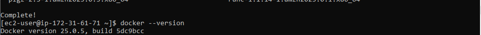

# Docker-Fastapi-Test
## Overview

We have a simple FastAPI application that needs to be dockerized. This can be done by using the Docker. For aplication files like code and requrirements are stored in a Github. 
Repository: https://github.com/RohitPatil18/docker-fastapi-test 

We should be able to run an application using a docker-compose file. Please note that we are not using a database instead storing data in a users.json file in the data directory which will get automatically created if not present. 

Once the application runs successfully, make sure to destroy containers and recreate another one and check if previous data is still present.

## Step-By-Step Implementation
### 1. Setting Up the AWS amazon-linux2 Instance:
##### A.  Launch an EC2 Instance:
         - Go to the AWS Management Console and navigate to EC2.
         - Click "Launch Instance" and select an Amazon-linux2 AMI.
         - Choose an instance type (e.g., t2. micro for free tier eligibility).
         - Configure instance details, add storage, and add tags if necessary.
         - Configure security group to allow HTTP (port 80), HTTPS (port 443), and SSH (port 22) access.
         - Review and launch the instance.
         
##### Connect to the EC2 instance:
      Use SSH to connect to your instance.
 - ssh -i your-key-pair.pem ec2-user@<your-instance-public-ip>

### 2.  Install Docker On Linux:
##### A. Update the package index:

- sudo yum update
- sudo yum install -y docker

  Now, run docker command:

- docker --version
  
- docker run hello-workld
  When we run above command, Docker deamon creates a sample hello world container. 
but, Output we axcpected as **permission denaied**: 

 

##### B. Providing a Docker privilidges 
 So this we need to provide the admin priviledges to run the docker commands.

 
  
