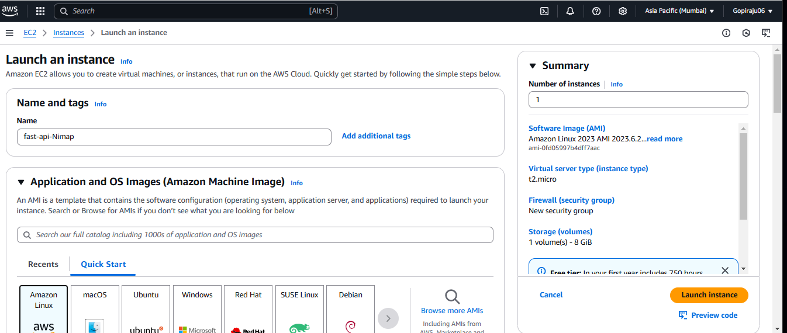
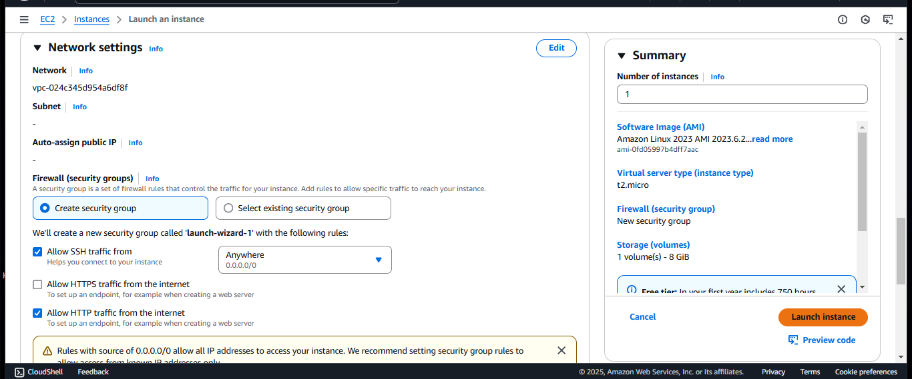
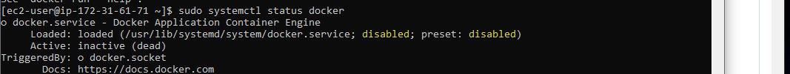
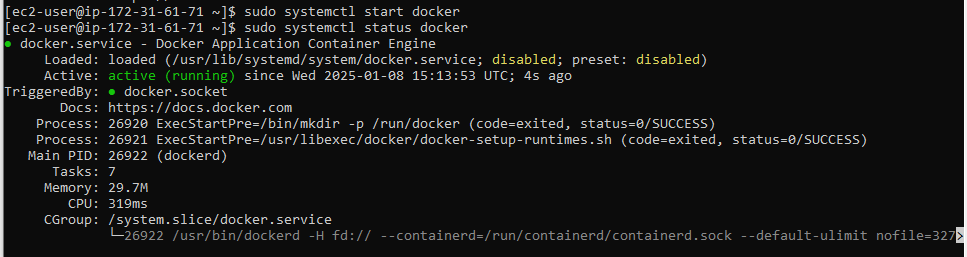
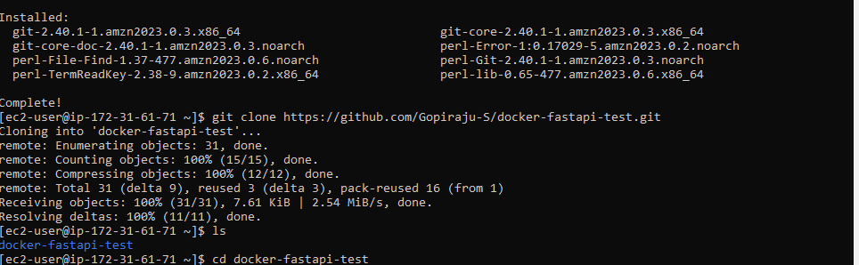

# Docker-Fastapi-Test
## Overview

We have a simple FastAPI application that needs to be dockerized. This can be done by using the Docker. For aplication files like code and requrirements are stored in a Github. 
Repository: https://github.com/RohitPatil18/docker-fastapi-test 

We should be able to run an application using a docker-compose file. Please note that we are not using a database instead storing data in a users.json file in the data directory which will get automatically created if not present. 

Once the application runs successfully, make sure to destroy containers and recreate another one and check if previous data is still present.

## Step-By-Step Implementation
### 1. Setting Up the AWS amazon-linux2 Instance:
##### A.  Launch an EC2 Instance:
   1. Go to the AWS Management Console and navigate to EC2.
   2. Click "Launch Instance" and select an Amazon-linux2 AMI.
   3. Choose an instance type (e.g., t2. micro for free tier eligibility).

 

   4. Configure instance details, add storage, and add tags if necessary.
   5. Configure security group to allow HTTP (port 80), HTTPS (port 443), and SSH (port 22) access.
   6. Review and launch the instance.
      

         
##### Connect to the EC2 instance:
Use SSH to connect to your instance.
     ssh -i your-key-pair.pem ec2-user@your-instance-public-ip

### 2.  Install Docker On Linux:
##### A. Update the package index:
     sudo yum update
     sudo yum install -y docker

Now, run docker command:

     docker --version
  
     docker run hello-workld
     
When we run above command, Docker deamon creates a sample hello world container. 
but, Output we axcpected as **permission denaied**: 

 

##### C. Start and enable Docker service:

        #check for docker status
        systemctl status docker

 
 
    sudo systemctl start docker
    sudo systemctl enable docker
    systemctl status docker
    
 
 
##### B. Provide a Docker privilidges 
 So this we need to provide the admin priviledges to run the docker commands.
     - # Create the docker group
     - sudo groupadd docker

     - # Add the ec2-user to docker
     - sudo usermod -aG docker ec2-user
     
Again do sample docker run command:

      - docker run hello-world
      - #output: ----
          # Hello from Docker!
          # This message shows that your installation appears to be working correctly.
           -----

### 3. install Git on an Amazon-linux2 system, follow these steps:
Update the Package Index
1. First, ensure your package index is up-to-date:
   
       sudo apt update

3. Install Git
Install Git using the package manager:

       sudo apt install git -y
   
4. Verify the Installation
Check the installed version of Git to verify the installation:

       git --version

Now, do the clone as mentioned abelow steps.

3. Prepare the FastApi Application:
Clone the Repository:

       git clone https://github.com/Gopiraju-S/docker-fastapi-test.git

Change the directory to the fastapi applicaton:

        cd docker-fastapi-test

### 4. Login to Docker [Create an account with https://hub.docker.com/]
Login with your Docker ID to push and pull images from Docker Hub. If you don't have a Docker ID, head over to https://hub.docker.com to create one.
      docker login
      
      Login with your Docker ID to push and pull images from Docker Hub. If you don't have a Docker ID, head over to https://hub.docker.com to create one.
      Username: gopiraju06
      Password:
      WARNING! Your password will be stored unencrypted in /home/ubuntu/.docker/config.json.
      Configure a credential helper to remove this warning. See
      https://docs.docker.com/engine/reference/commandline/login/#credentials-store

      Login Succeeded

### 5. Create the DOckerfile.yml

Here, Dockerfile already created in my Github repocitory:
And we can create the Dockerfile in aplication level folder.

    sudo nano Dockerfile

Enter the docker text.
    

### 5. Create Docker FastApi Image:

Check for existed list of images:

     docker images

Command to Create the Docker Image:

     docker build -t Gopiraju-S/fast-api-image .

     docker images
 

     
